# AREP Lab 7 - Concurrent Java Microframework with Graceful Shutdown and Docker Deployment

This project was developed for the Application Server Architectures as an evolution of the previous reflection and IoC lab. The goal is to build and package a lightweight Spring-inspired web framework in Java without using Spring Boot, adding two important server capabilities: concurrent request handling and graceful shutdown. The framework discovers controllers dynamically through custom annotations such as `@RestController`, `@GetMapping`, and `@RequestParam`, resolves HTTP GET routes, serves static resources, and invokes controller methods using Java Reflection. On top of that, the lab includes the containerization process with Docker, optional publication to DockerHub, and deployment evidence for local and cloud-based execution.

# Getting Started

These instructions will get you a copy of the project up and running on your local machine for development and testing purposes. The project is built with Maven and Java 21, and it includes a small Spring-like framework implemented from scratch. The application supports annotated controllers, query parameters, static resources, concurrent request processing with a thread pool, and graceful shutdown through a controlled server stop sequence. See deployment for notes on how to build the Docker image, run the container, and prepare evidence for local or cloud deployment.

## Architecture Overview

The application follows a simple layered microframework architecture:

- **HTTP Server Layer**  
  Implemented in `MicroSpringBootG4`, which opens a `ServerSocket`, accepts client connections, dispatches them to a fixed thread pool, parses HTTP requests, and writes HTTP responses.

- **Annotation and Reflection Layer**  
  The framework scans the classpath for classes annotated with `@RestController`, inspects methods annotated with `@GetMapping`, and dynamically invokes them through reflection.

- **Routing Layer**  
  Routes are stored in an internal `Map<String, RouteHandler>`, where each URL path is associated with the controller instance and method that must handle the request.

- **Parameter Binding Layer**  
  Query parameters are parsed from the URI and injected into controller method arguments through the custom `@RequestParam` annotation.

- **Static Content Layer**  
  Static files are served from `src/main/resources/public`, allowing the framework to return HTML and image resources without additional dependencies.

- **Concurrency and Lifecycle Layer**  
  The server uses an `ExecutorService` to handle multiple requests in parallel and includes a graceful shutdown process that stops accepting new connections, closes the server socket, and waits for running tasks to complete.

## Class Design

The most relevant classes in the project are:

- **`MicroSpringBootG4`**  
  Core class of the framework. It loads controllers, registers routes, starts the HTTP server, delegates client requests to worker threads, parses query parameters, serves static files, and manages graceful shutdown.

- **`RestController`**  
  Custom annotation used to mark a class as a framework-managed controller.

- **`GetMapping`**  
  Custom annotation used to associate a controller method with a GET route.

- **`RequestParam`**  
  Custom annotation used to bind query parameters from the URL to method parameters.

- **`HelloController`**  
  Example controller with simple endpoints such as `/`, `/hello`, and `/pi`.

- **`GreetingController`**  
  Example controller showing parameterized route handling with `/greeting?name=...`.

- **`RouteHandler`**  
  Internal helper structure inside `MicroSpringBootG4` that stores the controller instance and the method to invoke for a route.

This design keeps the framework small, readable, and aligned with the academic purpose of demonstrating reflection, inversion of control ideas, and minimal web server behavior.

# Prerequisites

What things you need to install the software and how to install them.

- Java Development Kit (JDK) 21
- Apache Maven 3.8 or higher
- Git
- Docker Desktop or Docker Engine
- An IDE such as IntelliJ IDEA, Visual Studio Code, or Eclipse
- A terminal such as PowerShell, Git Bash, or the integrated terminal in your IDE

Check Java version:

```bash
java -version
````

Check Maven version:

```bash
mvn -version
```

Check Git version:

```bash
git --version
```

Check Docker version:

```bash
docker --version
```

Check Docker Compose version:

```bash
docker compose version
```

# Installing

A step by step series of examples that tell you how to get a development environment running.

Clone the repository.

```bash
git clone https://github.com/your-username/lab7-Arep
cd lab7-Arep
```

Compile the project and generate the build artifacts.

```bash
mvn clean package
```

Copy runtime dependencies for the Docker image.

```bash
mvn dependency:copy-dependencies
```

Run the application locally with the framework main class.

```bash
java -cp target/classes:target/dependency/* com.co.edu.escuelaing.lab7.MicroSpringBootG4 35000
```

On Windows PowerShell or CMD, use:

```bash
java -cp "target/classes;target/dependency/*" com.co.edu.escuelaing.lab7.MicroSpringBootG4 35000
```

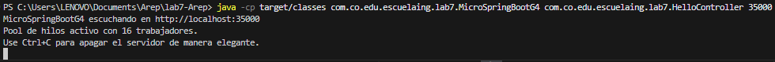

Test the root endpoint from the browser or with curl.

```bash
curl http://localhost:35000/
```

Expected output:

```text
Greetings from Spring Boot!
```

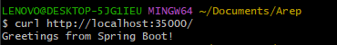

Test the hello endpoint.

```bash
curl http://localhost:35000/hello
```

Expected output:

```text
Hello World!
```


Test the pi endpoint.

```bash
curl http://localhost:35000/pi
```

Expected output:

```text
PI=3.141592653589793
```

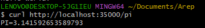

Test the greeting endpoint with query parameters.

```bash
curl "http://localhost:35000/greeting?name=David"
```

Expected output:

```text
Hello, David
```

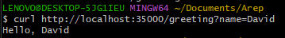

End with an example of getting some data out of the system or using it for a little demo.

A simple demo sequence is:

```bash
mvn clean package
mvn dependency:copy-dependencies
java -cp target/classes:target/dependency/* com.co.edu.escuelaing.lab7.MicroSpringBootG4 35000
curl http://localhost:35000/
curl http://localhost:35000/hello
curl http://localhost:35000/pi
curl "http://localhost:35000/greeting?name=World"
```

This demo proves that the framework can discover controllers dynamically, register routes, process query parameters, and return HTTP responses correctly.


# Running the tests

This project includes a basic Maven/JUnit test suite and several manual end-to-end validations that are especially important for this lab because the main learning objectives are related to runtime behavior, reflection-based route discovery, concurrency, and graceful shutdown.

Run the automated tests with Maven:

```bash
mvn test
```

Run a full verification build:

```bash
mvn clean verify
```

## Break down into end to end tests

These tests validate the framework behavior from start to finish.

### Route discovery and invocation test

This test verifies that annotated controllers are discovered and their routes are executed correctly.

```bash
curl http://localhost:35000/
curl http://localhost:35000/hello
curl http://localhost:35000/pi
curl "http://localhost:35000/greeting?name=Alice"
```

Why this matters: it validates reflection-based route registration, request parsing, query parameter binding, and response generation.

### Static resource test

This test verifies that the framework can serve static files from `src/main/resources/public`.

Open this URL in the browser:

```text
http://localhost:35000/
```

Or access a static file directly if exposed by your configuration.

Why this matters: it confirms that the framework can deliver resources in addition to dynamic controller responses.

### Concurrency test

Open multiple browser tabs or use concurrent curl requests while the server is running.

Example with several curl calls:

```bash
curl "http://localhost:35000/greeting?name=User1"
curl "http://localhost:35000/greeting?name=User2"
curl "http://localhost:35000/greeting?name=User3"
curl "http://localhost:35000/greeting?name=User4"
```
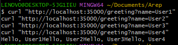


Why this matters: it validates that the server can process several requests using the thread pool instead of handling them strictly one by one.

### Graceful shutdown test

With the server running, stop it using:

```bash
Ctrl + C
```
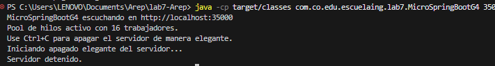

Why this matters: it verifies that the framework stops accepting new connections, closes the `ServerSocket`, and allows current tasks to finish before the application exits.

## And coding style tests

This project does not currently include a dedicated static code style tool such as Checkstyle, PMD, or SpotBugs. At this stage, code quality is validated mainly through successful compilation, the Maven lifecycle, manual inspection of class responsibilities, and the clarity of the framework structure.

A practical code-quality validation command is:

```bash
mvn clean verify
```

This command ensures that the project builds successfully and that the configured lifecycle phases execute correctly.

# Deployment

This project can be deployed with Docker locally, optionally pushed to DockerHub, and then executed on a remote machine such as an AWS EC2 instance.

## Important note before building the image

The project entry point is the framework class:

```text
com.co.edu.escuelaing.lab7.MicroSpringBootG4
```

The application default port is:

```text
35000
```

That means the container should expose and run the application on port `35000` unless you modify the Java code to read a port from an environment variable.

## Build the Docker image

```bash
docker build --tag lab7img . 
```

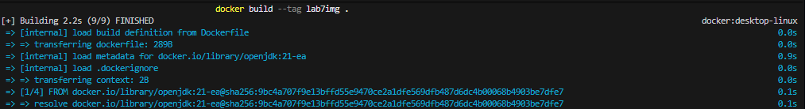

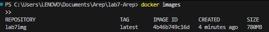
## Run the Docker container

```bash
docker run -d -p 34000:35000 --name firstdockercontainer lab7img
docker run -d -p 34001:35000 --name firstdockercontainer2 lab7img
docker run -d -p 34002:35000 --name firstdockercontainer3 lab7img
```
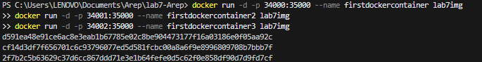

Check running containers:

```bash
docker ps
```


Test the containerized application:

```bash
curl http://localhost:34000/
curl http://localhost:34001/hello
curl http://localhost:34002/pi
curl "http://localhost:34001/greeting?name=Docker"
```
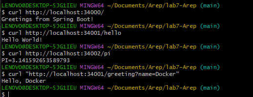

## Run with Docker Compose

The repository includes a `docker-compose.yml`. The compose file also defines a MongoDB service, although the current framework does not actively use MongoDB. It can remain as a future extension or be removed if the deployment only requires the web container.

Start services:

```bash
docker-compose up -d
```
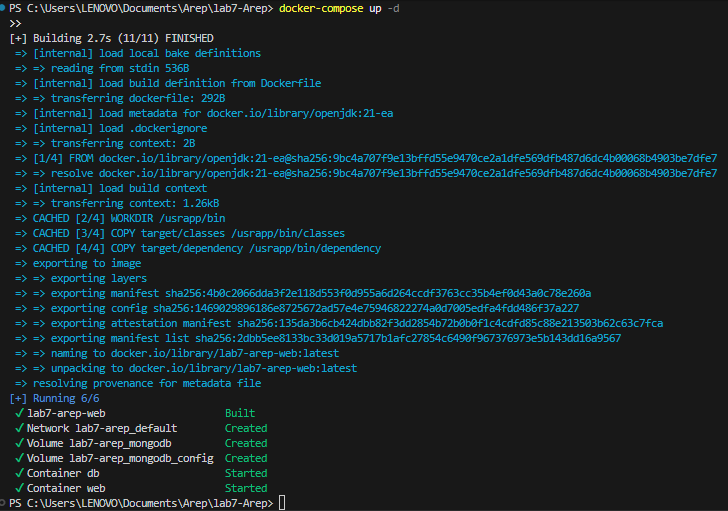

we can see:

```bash
curl "http://localhost:34001/greeting?name=Docker"
```

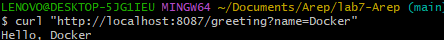

Stop services:

```bash
docker compose down
```

## Push the image to DockerHub

Log in to DockerHub:

```bash
docker login
```

Tag the image:

```bash
docker tag lab7img  daviidc29/lab7
```
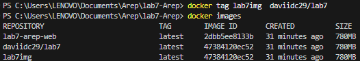

Push the image:

```bash
docker push daviidc29/lab7:latest
```
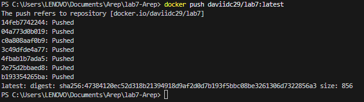

## Deploy on AWS EC2

Connect to your EC2 instance:

```bash
ssh -i your-key.pem ec2-user@your-ec2-public-ip
```

Install Docker if needed, pull the image, and run it:

```bash
sudo yum update -y
sudo yum install docker
sudo service docker start
sudo usermod -a -G docker ec2-user
docker run -d -p 42000:35000 --name lab7img daviidc29/lab7
docker ps
```
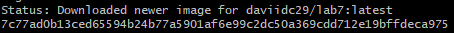

Validate the deployment from the browser or terminal:

```
http://ec2-3-88-182-55.compute-1.amazonaws.com:42000/
http://ec2-3-88-182-55.compute-1.amazonaws.com:42000/hello
http://ec2-3-88-182-55.compute-1.amazonaws.com:42000/greeting
http://ec2-3-88-182-55.compute-1.amazonaws.com:42000/greeting?name=david
http://ec2-3-88-182-55.compute-1.amazonaws.com:42000/index.html
http://ec2-3-88-182-55.compute-1.amazonaws.com:42000/logo.png
```
Results:

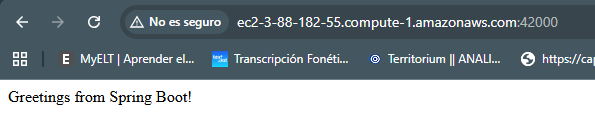

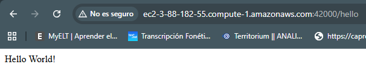

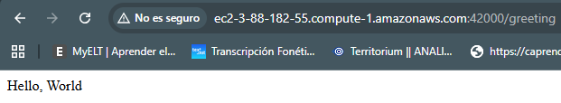

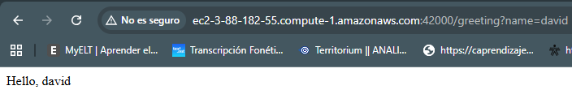

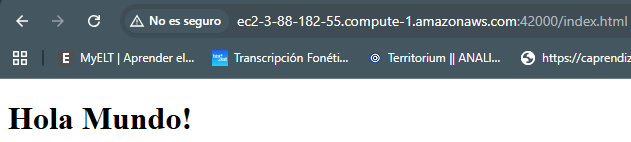

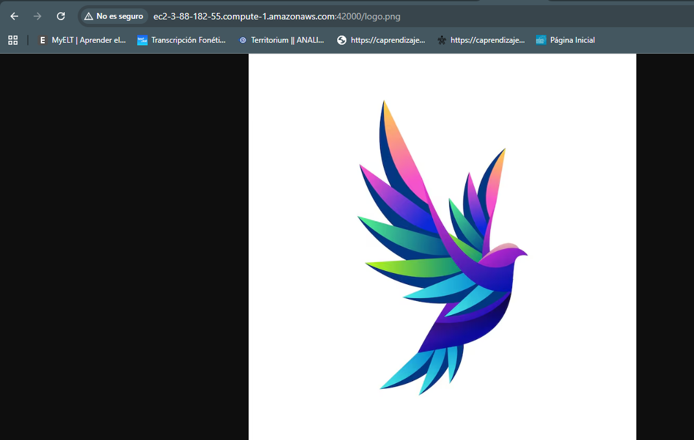
# Built With

* Java 21 - Main programming language used to implement the framework
* Maven - Dependency management and project lifecycle management
* Java Reflection API - Used to discover annotations, load controllers, and invoke methods dynamically
* Java Concurrency Utilities (`ExecutorService`, `AtomicBoolean`) - Used to support concurrent request processing and graceful shutdown
* Docker - Used to containerize and run the application
* Docker Compose - Used to orchestrate the application container and auxiliary services
* JUnit 4.11 - Used for the basic automated test structure included in the project
* AWS EC2 - Target environment for remote deployment evidence

# Contributing

Please read `CONTRIBUTING.md` for details on the code of conduct and the process for submitting pull requests to us. If the file does not exist yet, it can be added later as part of the repository documentation improvements.

# Versioning

We use SemVer for versioning. For the versions available, see the tags on this repository.

# Authors

* David Santiago Castro - Initial work

See also the list of contributors who participated in this project.

# License

This project is licensed under the MIT License - see the `LICENSE.md` file for details.

# Acknowledgments

* Escuela Colombiana de Ingeniería Julio Garavito for the academic context of the workshop
* The AREP course for the lab statement and requirements
* Oracle Java Documentation for the conceptual basis on reflection, sockets, concurrency, and annotations
* Maven for providing the project structure and lifecycle tooling
* Docker and DockerHub for enabling portable deployment and publication
* Inspiration from lightweight IoC and Spring-style controller mapping ideas implemented from scratch in Java

